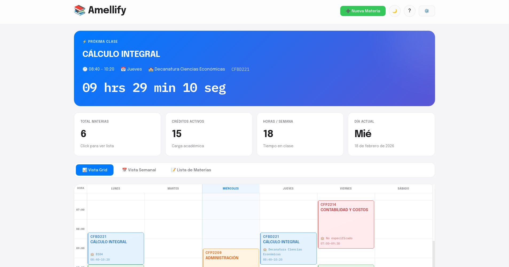
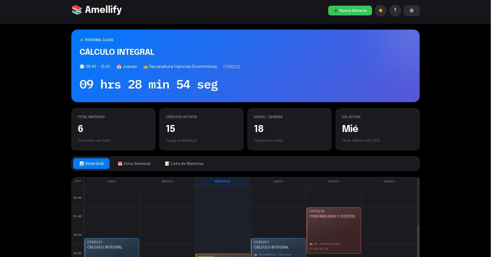
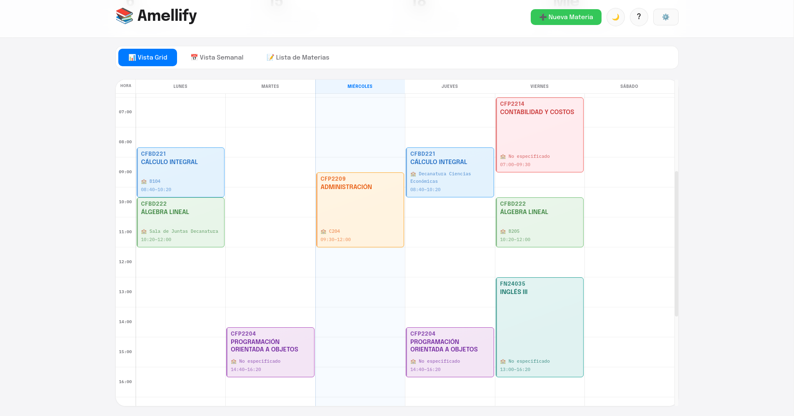
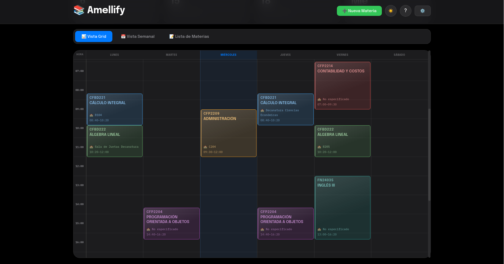

# 📚 Amellify — Gestor de Horarios Universitarios

<div align="center">


**Gestiona tus materias, horarios, profesores y aulas en una app web/PWA con sincronización en tiempo real.**

**Cuentas por usuario · PWA instalable · Datos en SQLite**

[Características](#-características) • [Instalación](#-instalación-rápida) • [Autenticación](#-autenticación) • [Productividad](#-productividad) • [PWA](#-pwa-y-offline) • [Uso](#-uso) • [Contribuir](#-contribuir)

</div>

---

## 📸 Vista Previa

<div align="center">

### Interfaz Principal

<table>
  <tr>
    <td width="50%" align="center">
      
      <br />
      <b>Modo Claro</b>
    </td>
    <td width="50%" align="center">
      
      <br />
      <b>Modo Oscuro</b>
    </td>
  </tr>
</table>

### Vista de Horario Grid

<table>
  <tr>
    <td width="50%" align="center">
      
      <br />
      <b>Grid 24h - Modo Claro</b>
    </td>
    <td width="50%" align="center">
      
      <br />
      <b>Grid 24h - Modo Oscuro</b>
    </td>
  </tr>
</table>

</div>

---

## 🌟 Características Destacadas

<table>
<tr>
<td width="50%">

### 🧮 Calculadora de Notas
Calcula tu nota final ponderada. Los porcentajes deben sumar 100%. Escala 0-5, passing >= 2.96.

</td>
<td width="50%">

### 🎯 Vista Grid Completa (24h)
Visualiza todo tu día de 00:00 a 23:59, no solo las horas con clases. Perfecto para planificar tu tiempo libre y ver el contexto completo de tu jornada.

</td>
</tr>
<tr>
<td width="50%">

### 🔴 Indicador en Tiempo Real
Línea roja horizontal con círculo pulsante en el día actual. Se actualiza automáticamente cada minuto para que siempre sepas dónde estás.

</td>
<td width="50%">

### 🎯 Auto-scroll Inteligente
Al abrir la app, el horario se posiciona automáticamente en tu clase actual, próxima clase, o la hora actual si no hay clases.

</td>
</tr>
<tr>
<td width="50%">

### ⌨️ Atajos de Teclado
Control total sin tocar el mouse. 13 atajos disponibles para navegación rápida, zoom, cambio de tema y más.

</td>

</td>
</tr>
<tr>
<td width="50%">

### 📏 Personalización de Texto
Tres tamaños configurables (Pequeño, Normal, Grande) desde el menú de configuración. Ajusta según tu preferencia.

</td>
<td width="50%">

### 🌐 Acceso Remoto
Accede desde cualquier dispositivo. Sincronización en tiempo real via WebSocket.

</td>
</tr>
</table>

---

## ✨ Características Completas

<details open>
<summary><b>📅 Vistas y Visualización</b></summary>

- **Vista Grid**: Horario semanal completo con 24 horas visibles
- **Vista Semana**: Tarjetas por día con tus clases organizadas
- **Vista Lista**: Lista completa de todas tus materias con detalles
- **Indicador en tiempo real**: Línea roja estilo Google Calendar
- **Auto-scroll inteligente**: Enfoque automático en clases relevantes

</details>

<details>
<summary><b>⚙️ Personalización</b></summary>

- **Temas**: Modo claro y oscuro con transiciones suaves
- **Tamaño de texto**: Tres niveles configurables (Pequeño, Normal, Grande)
- **Colores por materia**: 8 colores para identificar fácilmente tus clases
- **Zoom**: Control de zoom con atajos de teclado

</details>

<details>
<summary><b>📊 Gestión y Estadísticas</b></summary>

- **Temporizador**: Cuenta regresiva hasta tu próxima clase
- **Estadísticas en tiempo real**: Créditos totales, horas semanales, carga académica
- **Detección de conflictos**: Alerta automática de horarios superpuestos
- **Gestión completa**: Agregar, editar, eliminar materias con interfaz intuitiva

</details>

<details>
<summary><b>💾 Datos y Respaldo</b></summary>

- **Exportar/Importar**: Respaldo JSON de materias y configuración
- **Export completo**: Paquete JSON con materias, tareas, exámenes y ajustes (`/api/export/full`)
- **Backups automáticos**: Respaldo periódico al iniciar sesión (configurable)
- **Feed ICS personal**: URL revocable para suscribir el horario en calendarios externos
- **Import ICS URL**: Importar eventos desde un calendario `.ics` público
- **SQLite por usuario**: Datos aislados con autenticación JWT

</details>

<details>
<summary><b>🔔 Productividad y calendarios</b></summary>

- **Recordatorios v2**: Avisos por tipo (clase, tarea, examen) con ventana «no molestar»
- **Push PWA**: Notificaciones push con VAPID (opcional, requiere variables en `.env`)
- **Google Calendar**: OAuth opcional; alternativa sin OAuth: feed ICS en Configuración → Datos
- **Export PDF**: Impresión del horario desde Configuración → Datos
- **Modo offline**: Lectura de datos cacheados en el service worker + banner de estado

</details>

<details>
<summary><b>⌨️ Productividad</b></summary>

- **13 atajos de teclado**: Control total desde el teclado
- **Notificaciones silenciosas**: Feedback visual de cada acción
- **Modal de ayuda**: Botón `?` para ver todos los atajos
- **Navegación rápida**: Cambio instantáneo entre vistas

</details>

---

## ⚡ Instalación Rápida

### Requisitos
- Node.js v16+ → [Descargar aquí](https://nodejs.org)

### Instalación
```bash
npm install
```

### Iniciar la aplicación
```bash
# Modo Web (acceso desde cualquier dispositivo)
npm run web

# Modo escritorio (requiere entorno gráfico)
npm start
```

### Construir ejecutable
```bash
npm run build:win   # Windows
npm run build:mac   # macOS
npm run build:linux # Linux
```

---

## 🚀 Uso

### Modo Web (recomendado)
```bash
npm run web
```
Luego abre en tu navegador: `http://localhost:3000`

Copia `.env.example` a `.env` y ajusta secretos antes de producción.

### Modo escritorio
```bash
npm start
```
*Requiere entorno gráfico (X11/Wayland)*

### Scripts disponibles

| Script | Descripción |
|--------|-------------|
| `./iniciar-web.sh` | Iniciar servidor web en segundo plano |
| `./detener-web.sh` | Detener servidor web |
| `./iniciar-back.sh` | Iniciar backend en terminal |
| `npm test` | Tests unitarios e integración |
| `npm run test:e2e` | Prueba E2E con Puppeteer (puerto 30998) |

---

## Autenticación

Amellify usa **JWT** con registro, login y recuperación de contraseña. Cada usuario ve solo sus materias, tareas y exámenes.

| Rol | Descripción |
|-----|-------------|
| `user` | Acceso a sus propios datos |
| `admin` | Gestión de usuarios en Configuración → Usuarios |

En desarrollo se crea un admin inicial (ver `.env.example` y `CREDENCIALES-ADMIN-DEV.txt` local, no versionado).

Flujos principales:
- Registro / login desde la pantalla inicial
- Recuperar contraseña (enlace por correo; en modo test el enlace aparece en consola del servidor)
- Cierre de sesión desde Configuración → Cuenta

---

## Productividad

Funciones disponibles en **Configuración → Datos** y **Notificaciones**:

| Feature | Ubicación | Notas |
|---------|-----------|-------|
| Feed ICS | Datos | URL revocable + QR para suscribir en Google/Apple/Outlook |
| Export PDF | Datos | Abre diálogo de impresión del horario |
| Export completo | Datos | JSON con todo el perfil académico |
| Import ICS URL | Datos | Pega URL pública `.ics` con vista previa |
| Google Calendar | Datos | OAuth si `GOOGLE_CLIENT_*` están configurados |
| Recordatorios v2 | Notificaciones | Días antes (tarea/examen) + no molestar |
| Push PWA | Notificaciones | Requiere `VAPID_*` y permiso del navegador |
| Backup automático | Al iniciar sesión | Crea respaldo si pasó el intervalo configurado |

Atajo PWA: acceso directo a **Vista Hoy** desde el manifest (`/?view=today`).

---

## PWA y offline

- **Instalable**: `manifest.json` + service worker (`sw.js`)
- **Offline lectura**: cache de assets y respuestas GET de `/api/courses`, `/api/tasks`, `/api/exams`, `/api/stats`
- **Banner**: aviso «Sin conexión — mostrando datos guardados» cuando `navigator.onLine` es falso
- **Push**: el SW muestra notificaciones en evento `push` (envío desde servidor: pendiente de job programado en MVP)

Variables opcionales en `.env` — ver [`.env.example`](.env.example).

---

### Agregar una materia
1. Click en **➕ Nueva Materia**
2. Completa la información (código, nombre, créditos, profesor)
3. Agrega horarios con el botón **➕ Agregar Horario**
4. Selecciona un color y guarda

### Gestión de datos
- **Exportar**: Menú ⚙️ → 📤 Exportar JSON
- **Importar**: Menú ⚙️ → 📥 Importar JSON
- **Borrar todo**: Menú ⚙️ → 🗑️ Borrar Horario

---

## 🌐 Acceso Remoto

Accede desde cualquier dispositivo en la red:

```
http://100.101.28.97:3000
```

### Características
- 🔄 **Sincronización en tiempo real** - Cambios instantáneos en todos los dispositivos
- 📡 **WebSocket** - Conexión persistente bidireccional
- 🗄️ **SQLite** - Base de datos eficiente

### Scripts
```bash
./iniciar-web.sh   # Iniciar en segundo plano
./detener-web.sh   # Detener servidor
tail -f /tmp/amellify.log  # Ver logs
```

Para más detalles consulta [ACCESO-REMOTO.md](ACCESO-REMOTO.md).

---

## 🗄️ Ubicación de Datos

| Sistema | Ruta |
|---------|------|
| Linux   | `amellify.db` (carpeta del proyecto) |
| macOS   | `amellify.db` (carpeta del proyecto) |
| Windows | `amellify.db` (carpeta del proyecto) |

> **Nota**: A partir de v1.1, Amellify usa base de datos SQLite (`amellify.db`) en lugar del archivo JSON.

---

## ⌨️ Atajos de Teclado

| Atajo | Acción |
|-------|--------|
| `Ctrl/Cmd + N` | Nueva materia |
| `Ctrl/Cmd + 1` | Vista Grid |
| `Ctrl/Cmd + 2` | Vista Semana |
| `Ctrl/Cmd + 3` | Vista Lista |
| `Ctrl/Cmd + H` | Ir al horario (Grid + enfoque) |
| `Ctrl/Cmd + Shift + T` | Cambiar tema |
| `Ctrl/Cmd + R` | Recargar |
| `Ctrl/Cmd + +/=` | Acercar zoom |
| `Ctrl/Cmd + -` | Alejar zoom |
| `Ctrl/Cmd + 0` | Restablecer zoom |
| `F11` | Pantalla completa |
| `Esc` | Cerrar modal |
| `?` | Mostrar todos los atajos |

> **Nota**: En Mac usa `Cmd`, en Windows/Linux usa `Ctrl`

---

## 📁 Estructura del Proyecto

```
amellify/
├── src/
│   ├── css/          # Estilos
│   └── js/           # Lógica de la app
├── electron-main.js  # Configuración Electron
├── server.js         # API REST + servidor web
├── index.html        # Interfaz principal
└── package.json      # Dependencias
```

---

## 🛠️ Tecnologías

- **Electron** - Framework de escritorio
- **Express** - API REST y servidor web
- **Socket.io** - WebSocket para sincronización en tiempo real
- **sql.js** - Base de datos SQLite (pure JS)
- **Vanilla JS** - Sin frameworks pesados
- **CSS Variables** - Temas dinámicos

---

## 🔌 WebSocket

Amellify usa WebSocket para mantener todos los dispositivos sincronizados en tiempo real.

### Eventos

| Evento | Descripción |
|--------|-------------|
| `courses:update` | Actualización de materias |
| `stats:update` | Actualización de estadísticas |
| `config:update` | Actualización de configuración |

### Verificar conexión

Abre la consola del navegador (F12) y verifica:
```
WebSocket conectado
```

---

## 💡 Ideas y Mejoras

Revisa [IDEAS-MEJORAS.md](IDEAS-MEJORAS.md) para ver funcionalidades planeadas y sugerencias de mejora.

---

## 🎯 Funcionalidades Detalladas

Consulta [FUNCIONALIDADES.md](FUNCIONALIDADES.md) para una descripción completa de todas las características implementadas, incluyendo:
- Vista Grid completa (24 horas)
- Indicador de hora actual en tiempo real
- Auto-scroll inteligente
- Sistema de configuración de tamaño de texto
- Y mucho más...

---

## 📝 Formato de Importación

Consulta [FORMATO-IMPORTACION.md](FORMATO-IMPORTACION.md) para el esquema JSON de importación de materias.

---

## 🤝 Contribuir

1. Fork el proyecto
2. Crea una rama (`git checkout -b feature/nueva-funcionalidad`)
3. Commit tus cambios (`git commit -m 'Agregar nueva funcionalidad'`)
4. Push a la rama (`git push origin feature/nueva-funcionalidad'`)
5. Abre un Pull Request

---

## 📄 Licencia

MIT License - Usa, modifica y distribuye libremente.

---

## 👨‍💻 Autor

Desarrollado con ☕ para estudiantes universitarios.

---

## 🐛 Reportar Problemas

¿Encontraste un bug? [Abre un issue](../../issues)